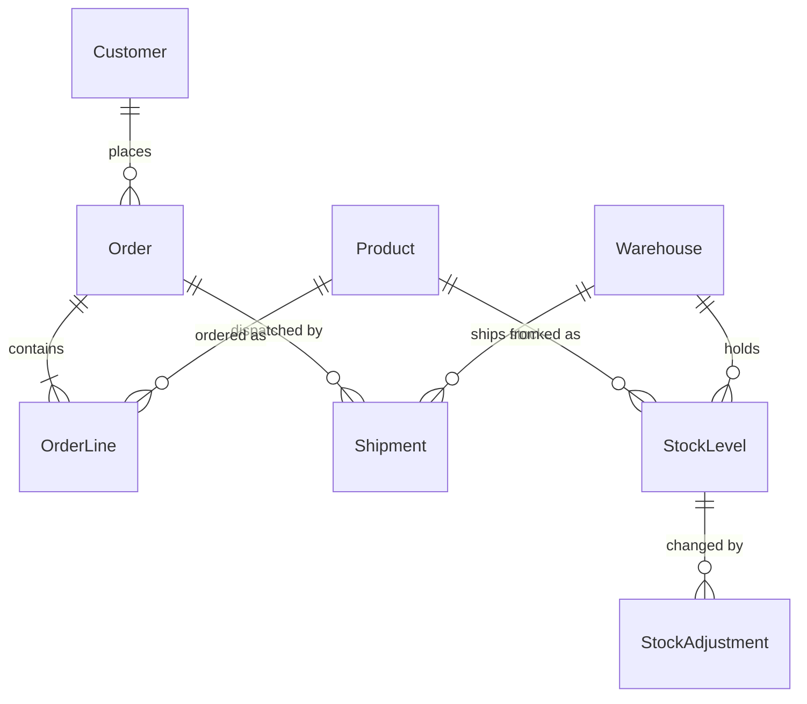

# Domain Overview

## Entities

| Entity | Purpose |
| --- | --- |
| `Product` | Catalogue item with a SKU and a list price |
| `Warehouse` | A physical stocking location (WH-A Atlanta, WH-B Boise, WH-C Columbus) |
| `StockLevel` | Quantity of one product in one warehouse: `OnHand` and `Reserved` |
| `StockAdjustment` | Append-only ledger of every stock movement |
| `Customer` | Who places orders |
| `Order` | A customer's purchase, with a status |
| `OrderLine` | One product on an order, with a price snapshot and a discount |
| `Shipment` | A dispatch of an order from one warehouse |

## Entity relationships



## Stock vocabulary

- **On hand** — physically present in the warehouse.
- **Reserved** — on hand, but committed to an order that has not shipped.
- **Available** — `OnHand - Reserved`. This is what can be promised to a new order.

## Order lifecycle

```
Pending ──▶ Reserved ──▶ Shipped
   │            │
   └────────────┴──────▶ Cancelled
```

- **Pending** — recorded, no stock committed.
- **Reserved** — stock committed, not yet dispatched.
- **Shipped** — dispatched; on-hand stock consumed and any reservation released.
- **Cancelled** — abandoned; any reservation released. Terminal.

## Pricing

`OrderLine.UnitPrice` is a snapshot taken when the order is placed — later
catalogue price changes never alter historical orders. `DiscountPercent` is a
whole percentage from 0 to 100 applied to that line. Money is `decimal` and
rounds to two places, half away from zero.

## Known limitation

Reservation was historically performed by a nightly batch job that has since been
retired. Seeded orders in `Reserved` status still hold their reservations, but the
API does not currently reserve anything at placement time. Story S1 closes that
gap.

## Conventions

Controllers are thin: they bind and validate input, call a service, and return.
All business logic lives in `src/InventoryApi/Services`. Entities never cross the
HTTP boundary — every endpoint takes and returns a DTO from
`src/InventoryApi/Dtos`. Domain failures are raised as `NotFoundException` (404)
or `ConflictException` (409) and rendered as `ProblemDetails` by middleware.
Follow these conventions in anything you add.
